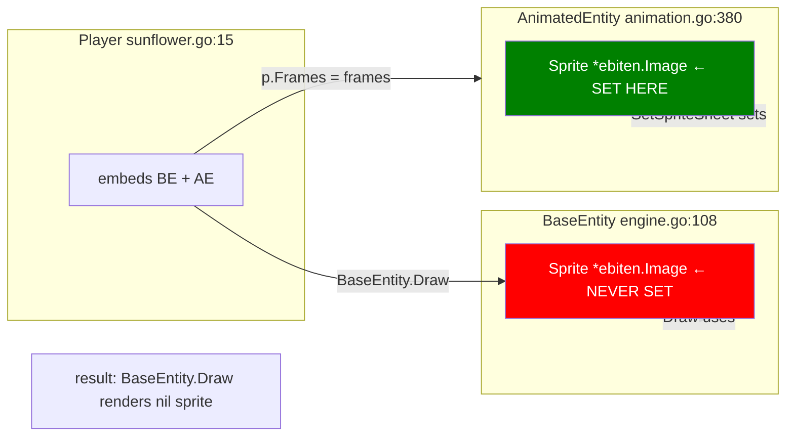

# Sunken Sunflower — Single Source of Truth Architecture

> **One diagram to rule them all** — every system, every relationship, every file.

```mermaid
flowchart TD
    %% ─── Entry Point ────────────────────────────────────────────────
    subgraph Entry[Entry Point]
        MAIN[main.go]
    end

    %% ─── Engine Core ────────────────────────────────────────────────
    subgraph EngineCore[engine/ — Core Framework]
        direction TB
        G[Game struct<br>engine.go:292]
        SM[SceneManager<br>engine.go:62]
        EM[EntityManager<br>engine.go:133]
        I[Input Handler<br>input.go]
        
        G --> SM
        G --> EM
        G --> I
    end

    %% ─── Scene System ────────────────────────────────────────────────
    subgraph Scenes[scenes/ — Screen States]
        direction TB
        TS[TitleScene<br>titlescene.go]
        TWN[TownScene<br>townscene.go]
        DNG[DungeonScene<br>dungeon.go]
        DRM[DreamScene<br>dreamscene.go]
    end

    SM -->|registers| Scenes

    %% ─── Animation System ────────────────────────────────────────────
    subgraph AnimSys[engine/animation.go — Animation]
        direction TB
        FA[FrameAnim]
        PA[PropAnim]
        AC[AnimationClip]
        AT[Animator]
        
        FA --> AC
        PA --> AC
        AC --> AT
    end

    %% ─── Entity Hierarchy ────────────────────────────────────────────
    subgraph Entities[entities/ — Game Objects]
        direction TB
        EINT[Entity interface<br>engine.go:97]
        BE[BaseEntity<br>engine.go:108]
        AE[AnimatedEntity<br>animation.go:380]
        PL[Player<br>sunflower.go]
        CM[Companion<br>companion.go]
        EN[Enemy<br>enemy.go]

        EINT -.->|implements| BE
        BE -.->|embeds into| PL
        BE -.->|embeds into| CM
        BE -.->|embeds into| EN
        AE -.->|embeds into| PL
        AE -.->|embeds into| CM
        AE -.->|embeds into| EN
        AE -->|uses| AT
    end

    %% ─── Isometric System ────────────────────────────────────────────
    subgraph Iso[engine/isometric.go — Isometric Rendering]
        direction TB
        IC[IsoConfig]
        IT[IsoTile]
        IM[IsoMap]
        ICA[IsoCamera]
        IED[IsoEntityDrawer]
        
        IM -->|grid of| IT
        IM -->|uses| IC
        IED -->|depth sorts| Entities
    end

    %% ─── Combat System ───────────────────────────────────────────────
    subgraph Combat[game/combat.go — Combat]
        direction TB
        DT[DamageType]
        CS[CombatStats]
        HR[HitResult]
        CH[CalculateHit]
        
        DT --> CH
        CS --> CH
        CH -->|returns| HR
    end

    %% ─── Hitbox System ───────────────────────────────────────────────
    subgraph Hitbox[engine/hitbox.go — Collision]
        direction TB
        HT[HitboxType]
        HB[Hitbox]
        HM[HitboxManager]
        AO[AABBOverlap]
        
        HM -->|manages| HB
        HT --> HB
        AO -->|checks| HB
    end

    %% ─── Dialogue System ─────────────────────────────────────────────
    subgraph Dialog[engine/dialogue.go — Dialogue]
        DM[DialogueManager]
        DB[DialogueBox]
        DTEXT[DialogueText]
    end

    %% ─── Effects / Particles ─────────────────────────────────────────
    subgraph Effects[engine/effects.go — Particles]
        direction TB
        PTCL[Particle]
        PE[ParticleEmitter]
        PM[ParticleManager]
        TW[Tween]
        TWM[TweenManager]
        
        PE -->|emits| PTCL
        PM -->|manages| PE
        TWM -->|manages| TW
    end

    %% ─── Game State ──────────────────────────────────────────────────
    subgraph GameState[game/state.go — State]
        direction TB
        GS[GameState]
        STM[StoryManager]
        CAM[Camera]
        
        GS -->|contains| CAM
    end

    %% ─── Save System ─────────────────────────────────────────────────
    subgraph SaveSys[game/save.go — Persistence]
        direction TB
        SS[SaveSlot]
        SAVE[SaveManager]
        
        SAVE -->|manages| SS
        SAVE -->|JSON| GS
    end

    %% ─── Season System ───────────────────────────────────────────────
    subgraph Seasons[game/seasons.go — Environment]
        direction TB
        SN[Season enum]
        SD[SeasonData]
        
        SD --> SN
        SD -->|AdvanceTime| SD
    end

    %% ─── Audio System ────────────────────────────────────────────────
    subgraph Audio[engine/audio.go + synth.go — Sound]
        direction TB
        AE2[AudioEngine]
        SYNTH[Synth]
        
        AE2 -->|plays| SYNTH
    end

    %% ─── Networking ──────────────────────────────────────────────────
    subgraph Net[net/network.go — Multiplayer]
        direction TB
        NM[NetworkManager]
        PID[PeerID]
        MSG[Message]
        PS[PlayerState]
        
        NM -->|sends| MSG
        MSG -->|contains| PS
    end

    %% ─── Mod System ──────────────────────────────────────────────────
    subgraph Mods[mods/modsync.go — Modding]
        direction TB
        MI[ModInfo]
        MM[ModManifest]
        MSM[ModSyncManager]
        
        MSM -->|discovers| MI
        MSM -->|generates| MM
    end

    %% ─── Procedural Generation ──────────────────────────────────────
    subgraph ProcGen[engine/ — Generation]
        direction TB
        ENVG[environment.go<br>Terrain]
        FLOOD[flood.go<br>Fill Algorithm]
        PAL[palette.go<br>Colors]
        FONT[font.go<br>Text]
    end

    %% ─── Turn-Based System ──────────────────────────────────────────
    subgraph TurnBased[engine/turnbased.go — Turn Combat]
        direction TB
        TBS[TurnBattleSystem]
        
        TBS -->|uses| Combat
        TBS -->|uses| Hitbox
    end

    %% ─── Settings ────────────────────────────────────────────────────
    subgraph Settings[engine/settings.go — Config]
        direction TB
        ST[Settings struct]
        ST[SteamDeck defaults]
    end

    %% ─── Cross-System Connections ────────────────────────────────────
    G -->|allocates| PM
    G -->|allocates| TWM
    
    MAIN -->|creates| G
    MAIN -->|creates| GS
    MAIN -->|creates| STM
    MAIN -->|creates| SAVE
    MAIN -->|creates| MSM
    MAIN -->|registers| Scenes
    
    DNG -->|uses| IM
    DNG -->|uses| ICA
    DNG -->|uses| IED
    DNG -->|uses| HM
    DNG -->|uses| DM
    DNG -->|spawns| EN
    DNG -->|spawns| PL
    
    TWN -->|spawns| PL
    TWN -->|spawns| CM
    TWN -->|uses| DM
    
    PL -->|has| CS
    EN -->|has| CS
    Combat -->|uses| GS
    
    Seasons -->|affects| GS
    GS -->|saved by| SAVE
```



---

## File Inventory

| File | Lines | System |
|------|-------|--------|
| `main.go` | 179 | Entry point |
| `internal/engine/engine.go` | 379 | Core Game, Scene/Entity interfaces, SceneManager, EntityManager, BaseEntity |
| `internal/engine/animation.go` | 753 | FrameAnim, PropAnim, AnimationClip, Animator, AnimatedEntity, TweenManager |
| `internal/engine/effects.go` | 767 | Easing, Tween, Particle, ParticleEmitter, ParticleManager, StarField, LightRays |
| `internal/engine/graphics.go` | 264 | Graphics primitives (circles, lines, rectangles) |
| `internal/engine/environment.go` | 513 | Procedural terrain/tile generation |
| `internal/engine/input.go` | 125 | Keyboard/gamepad input handling |
| `internal/engine/hitbox.go` | 284 | AABB hitboxes, collision detection, HitboxManager |
| `internal/engine/isometric.go` | 417 | IsoConfig, IsoTile, IsoMap, IsoCamera, IsoEntityDrawer |
| `internal/engine/dialogue.go` | 368 | DialogueManager, DialogueBox |
| `internal/engine/audio.go` | 374 | Audio playback |
| `internal/engine/synth.go` | 367 | Sound synthesis |
| `internal/engine/flood.go` | 234 | Flood-fill algorithm for terrain |
| `internal/engine/turnbased.go` | 298 | Turn-based battle system |
| `internal/engine/palette.go` | 26 | Named color constants |
| `internal/engine/font.go` | 46 | Font/text rendering |
| `internal/engine/settings.go` | 148 | Settings management |
| `internal/entities/sunflower.go` | 266 | Player entity |
| `internal/entities/companion.go` | 181 | Companion entity/AI |
| `internal/entities/enemy.go` | ~300 | Enemy entity/AI |
| `internal/game/state.go` | 255 | GameState, StoryManager, Camera |
| `internal/game/combat.go` | 412 | CombatStats, HitResult, damage calculation |
| `internal/game/save.go` | 319 | SaveManager, SaveSlot, load/save |
| `internal/game/seasons.go` | 380 | Season/weather/day-night cycle |
| `internal/game/creatures.go` | ~150 | Creature definitions |
| `internal/net/network.go` | 651 | P2P networking, messages, discovery |
| `internal/mods/modsync.go` | 311 | Mod scanning, manifests, sync |
| `internal/scenes/titlescene.go` | 272 | Title/menu scene |
| `internal/scenes/townscene.go` | 786 | Town hub scene |
| `internal/scenes/dungeon.go` | 317 | Dungeon crawler scene |
| `internal/scenes/dreamscene.go` | 232 | Dream/narrative scene |
| **Total** | **~11,000** | |

---

## Issues Requiring Code Changes

### 🔴 Critical: Duplicate `Sprite` in BaseEntity + AnimatedEntity



**Fix:** Remove `Sprite *ebiten.Image` from `BaseEntity`. Entities that need sprites use `AnimatedEntity`.

### 🟡 Medium: EntityManager bypassed by scenes

```mermaid
flowchart LR
    subgraph SceneMgr[SceneManager]
        EM_MGR[EntityManager<br>map string Entity]
    end
    subgraph DNG[DungeonScene]
        LOCAL_PL[player *Player ← LOCAL]
        LOCAL_EN[enemies []*Enemy ← LOCAL]
    end
    EM_MGR -->|Add Get Remove| ENTITY
    DNG -.->|should use| EM_MGR
    
    note[EntityManager has entities map<br>but DungeonScene uses local slices]
```

### 🟢 Low: Coverage + Test gaps

See `plans/coverage-enforcement.md` for the full coverage pipeline design.